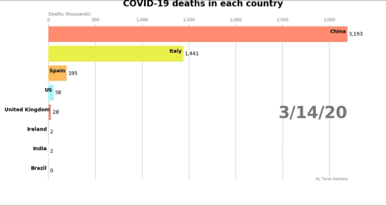

# Bar-Chart-Race-Animation (Covid-19 Deaths)

This repository contains code for Bar Chart Animation in Python using Matplotlib. 
The COVID-19 data was sourced from John Hopkins University github page - https://github.com/CSSEGISandData/COVID-19

Below is a part of the animation:

